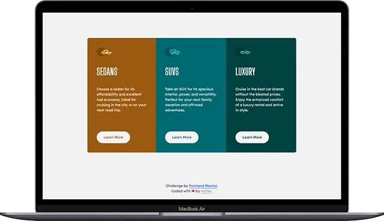

# Frontend Mentor - 3-column preview card component solution

This is a solution to the [3-column preview card component challenge on Frontend Mentor](https://www.frontendmentor.io/challenges/3column-preview-card-component-pH92eAR2-). Frontend Mentor challenges help you improve your coding skills by building realistic projects.

## Table of contents

- [Overview](#overview)
  - [The challenge](#the-challenge)
  - [Screenshots](#screenshots)
  - [Links](#links)
- [Getting started](#getting-started)
- [My process](#my-process)
  - [Built with](#built-with)
  - [Deployed with](#deployed-with)
- [Author](#author)

## Overview

### The challenge

Users should be able to:

- View the optimal layout depending on their device's screen size
- See hover states for interactive elements

### Screenshots

- Mobile:

  

- Laptop/Desktop:

  

### Links

- Solution URL: [frontend-mentor-solution](https://www.frontendmentor.io/solutions/responsive-card-component-with-tailwind-css-ZWpBUVtz0-)
- Live Site URL: [3-column-preview-card-component](https://3-column-preview-card-component-navy-iota.vercel.app/)

## Getting started

1. Clone the project and run the following command:

```console
yarn install
```

This will initialize the project by installing all the required dependencies.

2. Start the development server:

```console
yarn run dev
```

3. Build for production (output to the `/dist` folder):

```console
yarn run build
```

## My process

### Built with


- Semantic HTML5 markup
- Tailwind CSS
- CSS Grid
- Vite bundler
- Mobile-first workflow

### Deployed with


## Author

- Github - [ddZ6ii](https://github.com/ddZ6ii)
- Frontend Mentor - [ddZ6ii](https://www.frontendmentor.io/profile/ddZ6ii)
- Linkedin - [denis-dezest](https://www.linkedin.com/in/denis-dezest/)
